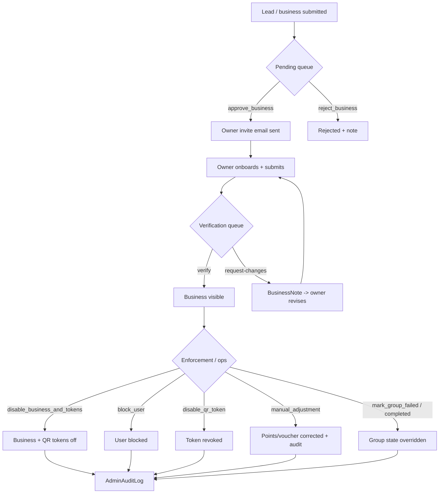

# Admin Operations (backend reference)

Not a user-initiated end-to-end workflow — there is **no Next frontend** for these.
They are exercised through the Django admin (django-unfold) by platform staff and
hit the `/api/admin/**` routes directly. This doc is the backend reference for the
three operational areas: the **verification queue**, **enforcement**, and **manual
adjustments**. A flowchart of the admin decision paths replaces the FE→BE→FE
sequence template.

## Surface

| Area | Method + path | View (file:line) | Service |
|---|---|---|---|
| Pending queue | GET `/api/admin/businesses/pending/` | PendingBusinessesView (`businesses/admin_urls.py:14`) | — |
| Approve | POST `/api/admin/businesses/<id>/approve/` | ApproveBusinessView (`admin_urls:15`, `admin_views.py:29`) | `approve_business` → `send_owner_invite_email` |
| Reject | POST `/api/admin/businesses/<id>/reject/` | RejectBusinessView (`admin_urls:16`) | `reject_business` |
| Disable | POST `/api/admin/businesses/<id>/disable/` | DisableBusinessView (`admin_urls:17`) | `disable_business` / `disable_business_and_tokens` |
| Verification queue | GET `/api/admin/business-verifications/` | VerificationQueueView (`admin_urls:18`) | — |
| Verify | POST `/api/admin/business-verifications/<id>/verify/` | VerifyBusinessView (`admin_urls:19`) | verify + visibility flip |
| Request changes | POST `/api/admin/business-verifications/<id>/request-changes/` | RequestChangesView (`admin_urls:20`) | `add_business_note` |
| Metrics | GET `/api/admin/metrics/` | AdminMetricsView (`reporting/admin_urls.py:14`) | `admin_metrics` |
| Manual adjustment | POST `/api/admin/manual-adjustment/` | AdminManualAdjustmentView (`reporting/admin_urls:15`) | `manual_adjustment` + `audit` |
| Block user | POST `/api/admin/users/<id>/block/` | AdminBlockUserView (`reporting/admin_urls:16`) | `block_user` |
| Disable QR token | POST `/api/admin/qr-tokens/<id>/disable/` | AdminDisableQRTokenView (`reporting/admin_urls:17`) | `disable_qr_token` |
| Group fail | POST `/api/admin/groups/<id>/fail/` | AdminGroupFailView (`reporting/admin_urls:18`) | `mark_group_failed` |
| Group complete | POST `/api/admin/groups/<id>/complete/` | AdminGroupCompleteView (`reporting/admin_urls:19`) | `mark_group_completed` |
| Scan logs | GET `/api/admin/scan-logs/` | AdminScanLogsView (`reporting/admin_urls:20`) | `suspicious_scan_rows` |
| Notification logs | GET `/api/admin/notification-logs/` | (`notifications/admin_urls`) | — |

Every mutating action records an `AdminAuditLog` via `reporting/services.py audit()`.
`campaigns/admin_urls.py` is a placeholder (platform-wide/sponsored campaigns are a
later phase).

## Flow

## Entry & exit

- **Entry:** Django admin (`/admin/`, unfold) — platform staff only.
- **Exit:** verification gates a business's public visibility
  (see [business-registration-onboarding](business-registration-onboarding.md));
  enforcement actions are terminal and audited.

## Notes

- These routes are **🟠 orphan from the Next frontend by design** — don't flag them
  as dead. They're consumed by the admin UI.
- The `request-changes` loop is the only path that returns control to the owner;
  it writes a `BusinessNote` that surfaces in the onboarding thread.
