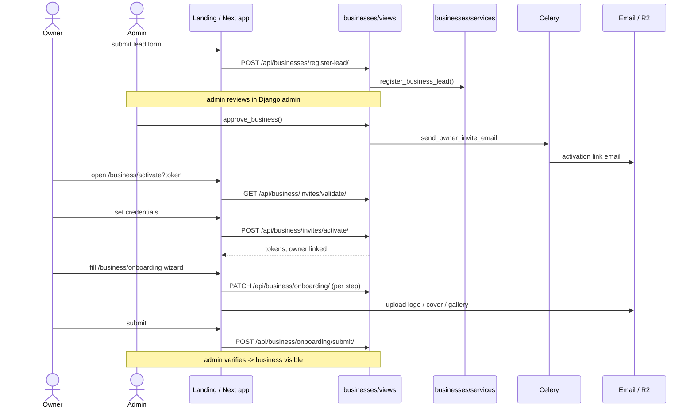

# Business Registration & Onboarding

## Summary

How a merchant goes from a marketing-site lead to a live, verified business.
Two human-gated waits sit in the middle: an admin **approves** the lead (which
emails an activation link), and after the owner fills the **onboarding wizard** and
**submits**, an admin **verifies** the business before it's publicly visible.
Triggered by a prospective owner on the `landing/` site (or the in-app
`/business/register` form).

## Layers & services involved

- **Frontend:** `landing/` lead form; `/business/register`, `/business/activate`,
  `/business/onboarding`, `/business/dashboard`; API in
  `frontend/packages/api/src/business/api.ts`.
- **Backend:** `businesses/views.py` (`BusinessLeadCreateView`,
  `BusinessRegisterView`, `OwnerInviteValidateView`, `OwnerInviteActivateView`,
  `OnboardingView`, `OnboardingSubmitView`); `businesses/admin_views.py`
  (`ApproveBusinessView`, `VerifyBusinessView`); `businesses/services.py`
  (`register_business_lead`, `register_business`, `approve_business`).
- **Models:** `Business` (`OnboardingStatus`, `VerificationStatus`,
  `VisibilityStatus`), `BusinessType`, `BusinessOwnerInvite`, `BusinessNote`.
- **Queues:** Celery `send_owner_invite_email`.
- **Third-party:** SMTP (activation email; Mailpit `:8025` in dev), R2 media for
  logo/cover/gallery.

## Step-by-step

1. **Lead capture.** Landing form → `POST /api/businesses/register-lead/`
   (`public_urls:13`) → `BusinessLeadCreateView` (`views.py:117`) →
   `register_business_lead(...)`. Creates a `Business` in a pending state.
   **In:** name/contact/type. **Out:** `{success}`.
2. **Admin approves.** In Django admin, an admin runs
   `ApproveBusinessView` (`admin_views.py:29`) → `approve_business(business, user)`,
   which enqueues `send_owner_invite_email` with a `BusinessOwnerInvite` token.
   *(Backend-only — see [admin-operations](admin-operations.md).)*
3. **Activation email.** Owner receives a link to `/business/activate?token=…`.
4. **Validate token.** `/business/activate` calls
   `GET /api/business/invites/validate/?token=…` (`business/api.ts:112`) →
   `OwnerInviteValidateView` (`urls.py:34`). **Out:** invite + business summary.
5. **Activate.** Owner sets credentials → `POST /api/business/invites/activate/`
   (`business/api.ts:116`) → `OwnerInviteActivateView` (`urls.py:35`). Creates the
   owner `User`, links it to the `Business`, returns tokens. Routes to `/business`.
   - *(In-app alternative to steps 1–5: `POST /api/business/register/`,
     `business/api.ts:83` → `BusinessRegisterView`, `views.py:134` →
     `register_business`.)*
6. **Load onboarding state.** `/business/onboarding` calls
   `GET /api/business/onboarding/` (`business/api.ts:118`) → `OnboardingView`
   (`urls.py:36`). The wizard also pulls `GET /api/business-types/`
   (`business/api.ts:110`) to drive type-specific fields.
7. **Fill the wizard.** Each step PATCHes `/api/business/onboarding/`
   (`business/api.ts:120`). Logo/cover via `POST /api/business/profile/logo/`
   and `/cover/` (`business/api.ts:88,89`); catalog via
   `/api/business/catalog-items/` (`business/api.ts:124`); gallery via
   `/api/business/gallery/` (`business/api.ts:150`).
8. **Submit for verification.** `POST /api/business/onboarding/submit/`
   (`business/api.ts:121`) → `OnboardingSubmitView` (`urls.py:37`). Flips
   `OnboardingStatus`/`VerificationStatus` to pending-review.
9. **Admin verifies.** `VerifyBusinessView` (`admin_views.py`) → business becomes
   visible. The dashboard (`GET /api/business/dashboard/`, `business/api.ts:92`)
   reflects the live state.

## Mermaid

## Entry points & exit conditions

- **Entry:** landing lead form, or in-app `/business/register`.
- **Success:** owner activated, onboarding submitted, admin-verified, dashboard live.
- **Failure:** invalid/expired invite token (validate step 4 fails) → dead-end
  unless re-invited; submit blocked if required onboarding fields missing.

## Gaps

- 🟠 **Two human-gated waits** (approve, verify) with no in-app status surface
  between them — the owner is told to wait for email but the app shows no
  "pending approval" / "pending verification" state tied to `OnboardingStatus`.
  **Fix:** surface the `Business.verification_status` on `/business/dashboard` as a
  banner so the owner isn't blind between submit and verify.
- 📄 **Docs vs code:** `backend/docs/data-model.md` lists `reward_receiver_type`
  value `table` with no explanation — out of scope here but flagged during the doc
  inventory; clarify in the campaigns app doc.

## Friction (too many steps)

Current happy path is **6+ screens across 2 async waits**: lead → (wait) →
activate → wizard (multi-step) → submit → (wait) → live. Candidate reductions:
(a) auto-approve low-risk leads so step 2 isn't a manual gate; (b) collapse the
phone/credential step into the wizard's first slide; (c) let the business go
**visible-but-unverified** immediately on submit, with verification as a trust
badge rather than a visibility gate — removing the second wait from the critical
path. Each is a `businesses/services.py` change (`approve_business`,
`OnboardingSubmitView`), not a UI-only tweak.
