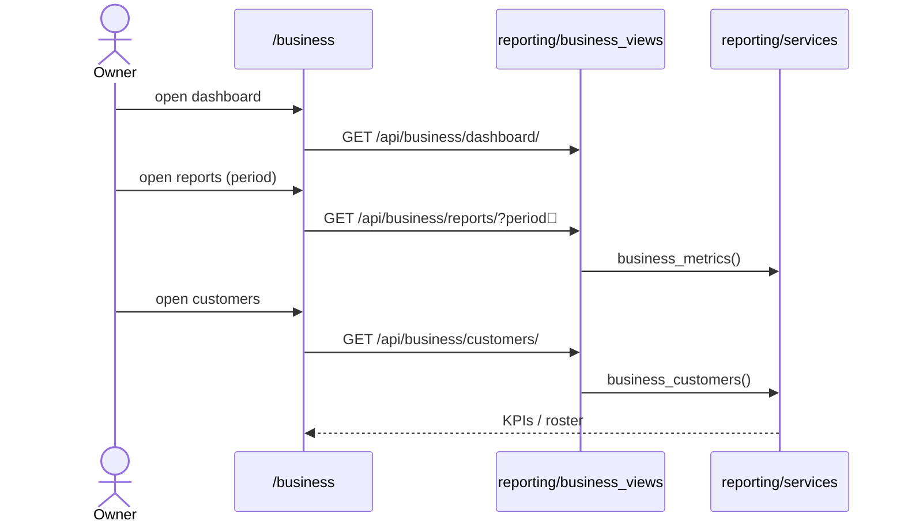

# Business Reports

## Summary

How an owner sees performance: dashboard KPIs, period reports, and the customer
roster. Read-only; served by the `reporting` app mounted under `/api/business/`.
Triggered by a business owner. Clean.

## Step-by-step

1. **Dashboard.** `/business/dashboard` → `GET /api/business/dashboard/`
   (`business/api.ts:92`, `BusinessDashboardView`, `businesses/urls.py:30`) →
   headline KPIs.
2. **Reports.** `/business/reports` → `GET /api/business/reports/?period=…`
   (`business/api.ts:103`, `reporting.business_urls`, `config/urls.py:29`) →
   `reporting/services.py business_metrics(...)`.
3. **Customers.** `/business/customers` → `GET /api/business/customers/`
   (`business/api.ts:106`) → `business_customers(...)` roster (phone masked via
   `mask_phone`).

## Mermaid

## Notes

No gaps. Admin-level metrics (`GET /api/admin/metrics/`, scan logs, manual
adjustments) are backend-only — see [admin-operations](admin-operations.md).
There is an active `docs/specs/reports-revamp-plan.md` — keep this doc in sync if
that ships.
