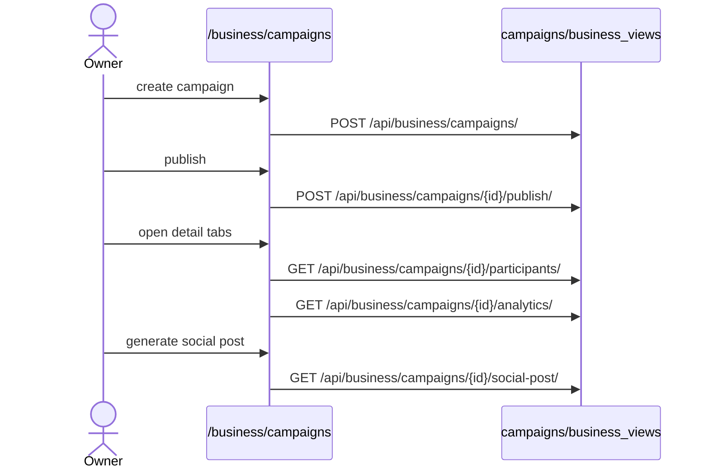

# Campaign Authoring

## Summary

The owner side of campaigns: create a campaign, publish it, run its lifecycle
(pause/resume/end/cancel), track participants/vouchers/analytics, and generate a
social post. Triggered by a business owner. Clean — every route is wired; lifecycle
actions go through one `campaignAction` helper.

## Step-by-step

1. **List.** `/business/campaigns` → `GET /api/business/campaigns/`
   (`business/api.ts:201`). Create at `/business/campaigns/new` →
   `POST /api/business/campaigns/` (`business/api.ts:208`).
2. **Edit.** `/business/campaigns/[id]` →
   `GET`/`PATCH /api/business/campaigns/<id>/` (`business/api.ts:205,212`). The
   detail payload is tabbed (overview / participants / reward_usage / groups /
   analytics).
3. **Lifecycle.** `campaignAction(id, action)` →
   `POST /api/business/campaigns/<id>/<action>/` (`business/api.ts:214`) where
   `action ∈ {publish, pause, resume, end, cancel}` (`business/types.ts:455`); the
   detail page renders exactly the controls valid for the current status
   (`business/campaigns/[id]/page.tsx:76`).
4. **Duplicate.** `POST /api/business/campaigns/<id>/duplicate/`
   (`business/api.ts:217`) → routes to the copy.
5. **Track.** Participants `GET …/participants/` (`:220`), vouchers `GET …/vouchers/`
   (`:224`), analytics `GET …/analytics/` (`:230`), cancel a voucher
   `POST …/vouchers/<id>/cancel/` (`:234`).
6. **Promote.** `GET …/social-post/` (`:240`, AI kit via `SocialPostStudio`) and
   image upload `PATCH …/image/` (`:249`).

## Mermaid

## Notes

No gaps. Backend lifecycle routes (`business_urls.py:35–58`) match the FE action
union exactly. Customer-facing consumption of these campaigns is
[campaign-collect-redeem](campaign-collect-redeem.md).
