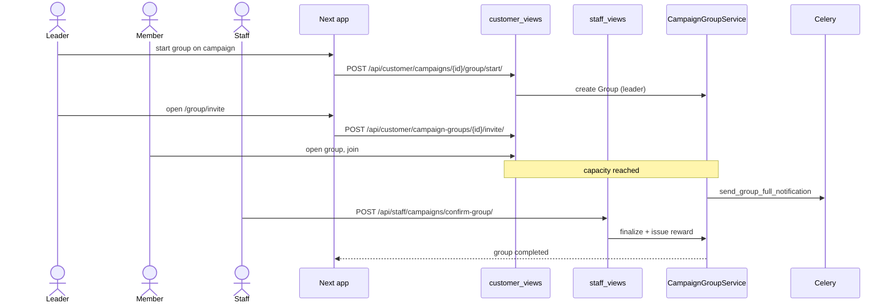

# Campaign Group Session

## Summary

A **group** campaign: one customer starts a session, invites others (or fills it
in demo mode), and once the group reaches capacity, staff confirms it so the group
reward is issued (e.g. to the leader, every member, or a table). Triggered by a
customer on a group-type campaign.

## Layers & services involved

- **Frontend:** `/campaigns/[id]/group`, `/campaigns/[id]/group/invite`;
  `_components/group-detail.tsx`, `_components/groups.tsx`; API in
  `frontend/packages/api/src/customer/api.ts`; staff confirm in
  `frontend/packages/api/src/staff/api.ts`.
- **Backend:** `campaigns/views/customer_views.py` + `views/staff_views.py`;
  service `group.py` (`CampaignGroupService`); `scanner.py` group branch.
- **Models:** `Group`, `GroupMember`, `Campaign`, `CampaignRewardVoucher`.
- **Queues:** Celery `send_group_full_notification`, `expire_old_groups`.

## Step-by-step

1. **Start a session.** From a group campaign,
   `POST /api/customer/campaigns/<id>/group/start/` (`customer/api.ts:265`,
   body `{visit_time, name, note}`) → `CampaignGroupService` creates a `Group` with
   the starter as leader. Routes to `/campaigns/<id>/group`.
2. **View the group.** `GET /api/customer/campaign-groups/<id>/`
   (`customer/api.ts:270`) renders members, capacity, and invite status. The list
   of a customer's groups is `GET /api/customer/campaign-groups/`
   (`customer/api.ts:279`).
3. **Invite members.** `/campaigns/[id]/group/invite` →
   `POST /api/customer/campaign-groups/<id>/invite/` (`customer/api.ts:272`)
   returns an invite payload/token; the screen shares it.
4. **Members join.** Invited customers open the group and join (same group-detail
   view). A member can leave via
   `POST /api/customer/campaign-groups/<id>/leave/` (`customer/api.ts:274`).
5. **Demo fill (dev/testing).**
   `POST /api/customer/campaign-groups/<id>/demo-fill/` (`customer/api.ts:276`)
   simulates the group reaching capacity.
6. **Group full.** When `GroupMember` count hits the campaign's required size,
   `CampaignGroupService` flips the group state and enqueues
   `send_group_full_notification`.
7. **Staff confirms.** Staff scans the group token →
   `POST /api/staff/campaigns/confirm-group/` (`staff/api.ts:139`) →
   `staff_views` group branch → `CampaignGroupService` finalizes and
   `CampaignRewardService` issues the reward per `reward_receiver_type`.

## Mermaid

## Entry points & exit conditions

- **Entry:** a group-type `Campaign` detail → "start group".
- **Success:** group fills, staff confirms, reward issued per receiver type.
- **Failure:** group never fills → `expire_old_groups` closes it; member leaves
  drop the count back below capacity.

## Gaps

- 🟠 **Group completion may be unreachable from the customer UI.**
  `docs/guides/campaigns-customer-workflow.md` records (Known gaps) that the group
  **check-in QR token is not minted**, so although `confirm-group` exists on the
  staff side, the customer may have no screen that surfaces a scannable group token
  for staff to confirm. **Open question — verify** against
  `campaigns/services/group.py` (does it mint a `QRCodeToken` for the group?) and
  the group-detail component (does it render one?). If absent, the fix is to mint a
  group token in `CampaignGroupService` on "group full" and render it in
  `_components/group-detail.tsx`, mirroring the personal-QR pattern.
- `demo-fill` is a production-exposed endpoint (`customer/api.ts:276`) — confirm
  it's gated to non-prod or demo businesses only.
