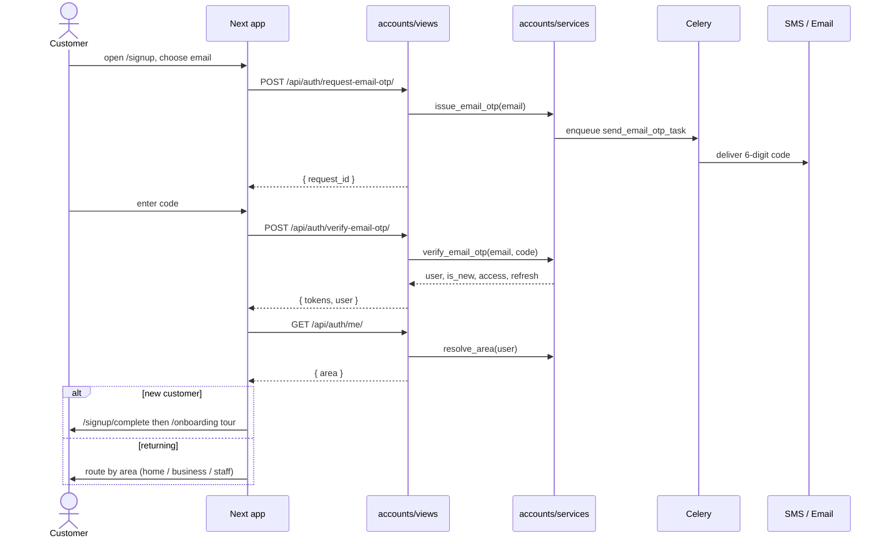

# Customer Auth

## Summary

How a customer gets a session. Three sign-in mechanics share one backend
(`accounts`): **phone OTP**, **email OTP** (the `/signup/email` path), and
**email + password** with a **password-reset** branch. Every successful path
returns a SimpleJWT access/refresh pair plus an `area` hint, and a new account is
routed into the post-signup tail (`/signup/complete` for phone completion, then
the `/onboarding` first-run tour). Triggered by any unauthenticated visitor.

## Layers & services involved

- **Frontend:** `/login`, `/signup`, `/signup/email`, `/signup/complete`,
  `/forgot-password`, `/onboarding`; API in `frontend/packages/api/src/customer/api.ts`;
  token persistence in `packages/api/src/tokens.ts`; refresh in `client.ts`.
- **Backend:** `accounts/views.py` → `accounts/services.py`
  (`issue_otp`/`verify_otp`, `issue_email_otp`/`verify_email_otp`,
  `authenticate_password`, `issue_password_reset_otp`/`reset_password`,
  `resolve_area`).
- **Models:** `User`, `CustomerProfile` (holds `onboarding_completed`), `Language`.
- **Queues:** Celery — `send_otp`, `send_email_otp_task`, `send_password_reset_otp_task`.
- **Third-party:** SMS provider (phone OTP), SMTP/Mailpit in dev (email codes).

## Step-by-step

1. **Pick a method.** `/signup` (`app/signup/page.tsx`) routes to `/signup/email`
   or to `/login` for returning users.
2. **Request a code (email path).** `/signup/email` calls
   `requestEmailOtp` → `POST /api/auth/request-email-otp/` (`customer/api.ts:141`)
   → `RequestEmailOTPView` (`accounts/views.py:82`) → `issue_email_otp(...)`, which
   enqueues `send_email_otp_task`. **In:** `{email}`. **Out:** `{request_id}`.
   - Phone path: `POST /api/auth/request-otp/` (`customer/api.ts:107`) →
     `RequestOTPView` (`views.py:60`) → `issue_otp` → `send_otp`.
3. **Verify.** `POST /api/auth/verify-email-otp/` (`customer/api.ts:144`) →
   `VerifyEmailOTPView` (`views.py:101`) → `verify_email_otp(...)` returns
   `(user, is_new, access, refresh)`. The client stores tokens via `tokenStore.set`.
   - Phone: `POST /api/auth/verify-otp/` (`customer/api.ts:110`).
4. **Password sign-in (alternative).** `/login` calls
   `POST /api/auth/login-password/` (`customer/api.ts:120`) → `PasswordLoginView`
   (`views.py:114`) → `authenticate_password(...)` → `(user, access, refresh)`.
5. **Password reset (branch).** `/forgot-password` calls
   `POST /api/auth/request-password-reset/` (`customer/api.ts:129`) then
   `POST /api/auth/reset-password/` (`customer/api.ts:132`) →
   `ResetPasswordView` (`views.py:137`) → `reset_password(...)` returns tokens
   (auto-login, no account enumeration). On success it `router.push("/login")`.
6. **Route by area.** Client calls `GET /api/auth/me/` (`customer/api.ts:153`) →
   `MeView` (`views.py:160`) which includes `"area": resolve_area(user)`
   (owner / staff / customer). `postAuthRoute` sends owners to `/business`, staff
   to `/staff`, customers home.
7. **Post-signup tail (new customers).** Phone-signup accounts that lack a
   complete profile are gated into `/signup/complete` (phone/profile completion).
   Then first-run customers whose `CustomerProfile.onboarding_completed` is false
   land on `/onboarding` (a 6-slide tour); completing it flips the flag and routes
   to the home feed.

## Mermaid

## Entry points & exit conditions

- **Entry:** any unauthenticated route; `/business/login` and `/staff/login`
  redirect here with `?return=`.
- **Success:** tokens stored, `area` resolved, user routed; new customers complete
  the onboarding tail.
- **Failure:** invalid/expired code, wrong password, throttled requests → field
  error surfaced on the form. Reset path is deliberately non-enumerating.

## Gaps

- 🟠 **Logout never blacklists the refresh token.** `useAuth().logout` and
  `staffApi.logout` (`staff/api.ts:44`) only call `tokenStore.clear()`. The backend
  `POST /api/auth/logout/` (`accounts/views.py:151`, `accounts/urls.py:25`) exists
  but is never called, so the refresh token stays valid until natural expiry.
  **Fix:** in the FE `logout()`, `await api.post("/api/auth/logout/", { refresh })`
  before clearing local state; or, if server-side revocation isn't wanted, delete
  the unused view + route.
- **Open question:** the phone-completion gate (`profile_completed`) and the
  onboarding-tour gate (`onboarding_completed`) are two sequential redirects for a
  fresh phone signup. Verify whether `/signup/complete` can be merged into the
  tour's first slide to drop one screen (see *Too many steps* in the README).
