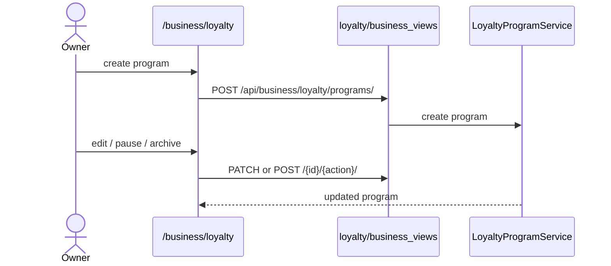

# Loyalty Authoring

## Summary

The owner side of loyalty: create and manage loyalty programs and run their
lifecycle (pause / activate / archive). A business can run several programs at once
(e.g. points→cashback alongside visits→item). Triggered by a business owner. Clean —
all routes wired.

## Step-by-step

1. **List.** `/business/loyalty` → `GET /api/business/loyalty/programs/`
   (`loyalty/api.ts:17`).
2. **Create.** `/business/loyalty/new` → `POST /api/business/loyalty/programs/`
   (`loyalty/api.ts:18`) → `LoyaltyProgramService`. Routes to the new program detail
   (`business/loyalty/new/page.tsx:388`).
3. **Edit.** `/business/loyalty/[id]` →
   `GET`/`PATCH /api/business/loyalty/programs/<id>/` (`loyalty/api.ts:19,20`).
4. **Lifecycle.** `POST /api/business/loyalty/programs/<id>/<action>/`
   (`loyalty/api.ts:21`) with `action ∈ {pause, activate, archive}`.

## Mermaid

## Notes

No gaps. Customer enrollment and the earn/redeem loop are in
[loyalty-earn-redeem](loyalty-earn-redeem.md).
