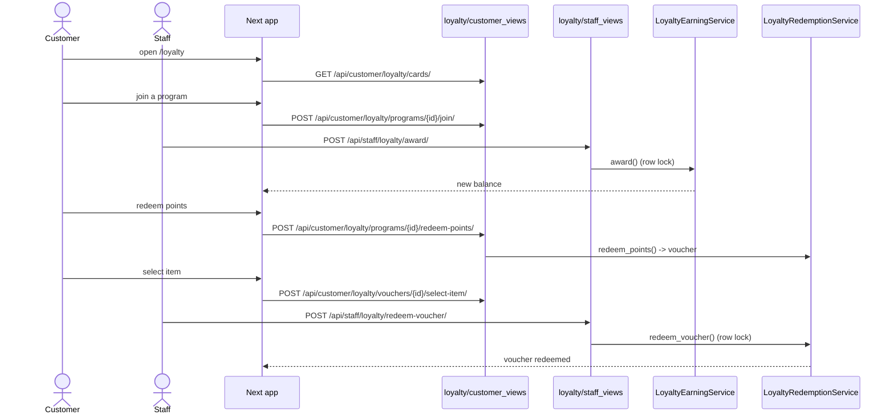

# Loyalty Earn & Redeem

## Summary

The standing loyalty loop (separate from campaigns): a customer joins a business's
loyalty program, staff awards points/visits at the till, and the customer redeems
points for a voucher and then an item. Money/points use `Decimal` and every
balance mutation takes a row lock. Triggered by a customer to join; earning and
redeeming are staff-driven at POS.

## Layers & services involved

- **Frontend:** `/loyalty`, `/loyalty/[id]`, `/rewards`, `/nearby/[id]` (business
  loyalty card); API in `frontend/packages/api/src/loyalty/api.ts`.
- **Backend:** `loyalty/customer_urls.py`, `loyalty/staff_urls.py`; services
  `membership.py` (`LoyaltyMembershipService`, `LoyaltyCardView`), `earning.py`
  (`LoyaltyEarningService.award`), `redemption.py` (`LoyaltyRedemptionService`
  `redeem_points`/`redeem_voucher`), `program.py`, `analytics.py`.
- **Models:** `LoyaltyProgram`, `LoyaltyMembership`, `LoyaltyTransaction`,
  `LoyaltyVoucher`.
- **Concurrency:** `select_for_update` on `LoyaltyMembership` (earn, redeem-points)
  and `LoyaltyVoucher` (redeem-voucher).

## Step-by-step

1. **Find programs.** `/loyalty` lists the customer's cards via
   `GET /api/customer/loyalty/cards/` (`loyalty/api.ts:9`). A business's programs
   show on its profile via
   `GET /api/customer/loyalty/businesses/<id>/loyalty/` (`loyalty/api.ts:10`).
2. **Program detail.** `GET /api/customer/loyalty/programs/<id>/`
   (`loyalty/api.ts:11`) → `LoyaltyCardView` shape (points, rules, rewards).
3. **Join.** `POST /api/customer/loyalty/programs/<id>/join/` (`loyalty/api.ts:12`)
   → `LoyaltyMembershipService` creates a `LoyaltyMembership`.
4. **Earn at POS.** Staff scans the customer's personal QR (see
   [staff-scan-unified](staff-scan-unified.md)); `POST /api/staff/loyalty/award/`
   (`loyalty/api.ts:22`, `staff/api.ts:76`) → `LoyaltyEarningService.award`
   (`earning.py:36`) locks the membership row, writes a `LoyaltyTransaction`, and
   updates the balance. POINTS programs prompt staff for an amount.
5. **Redeem points → voucher.**
   `POST /api/customer/loyalty/programs/<id>/redeem-points/` (`loyalty/api.ts:13`)
   → `LoyaltyRedemptionService.redeem_points` (`redemption.py:64`, row lock) debits
   points and mints a `LoyaltyVoucher`.
6. **Pick the reward item.** `GET /api/customer/loyalty/programs/<id>/catalog/`
   (`loyalty/api.ts:14`) then
   `POST /api/customer/loyalty/vouchers/<id>/select-item/` (`loyalty/api.ts:16`).
   Vouchers list at `GET /api/customer/loyalty/vouchers/` (`loyalty/api.ts:15`).
7. **Redeem voucher at POS.** Staff scans the voucher (payload prefixed
   `loyalty:`) → `POST /api/staff/loyalty/redeem-voucher/` (`loyalty/api.ts:23`,
   `staff/api.ts:136`) → `LoyaltyRedemptionService.redeem_voucher`
   (`redemption.py:146`, locks the voucher row) marks it redeemed.

## Mermaid

## Entry points & exit conditions

- **Entry:** `/loyalty` or a business profile's loyalty card.
- **Success:** points accrue under lock, redeem to a voucher, item selected,
  voucher redeemed at POS.
- **Failure:** insufficient points → `LoyaltyRedemptionService` raises a domain
  error (mapped to a 4xx by the DRF exception handler); concurrent redeem is
  serialized by `select_for_update`, so no double-spend.

## Gaps

- None broken. The redeem-voucher dispatch correctly splits `loyalty:`-prefixed
  payloads from campaign vouchers in `staff/api.ts:136`. (The dead
  `staffApi.redeem`/`redeemManual` legacy methods are unrelated to this live loop —
  see [staff-scan-unified](staff-scan-unified.md#gaps).)
