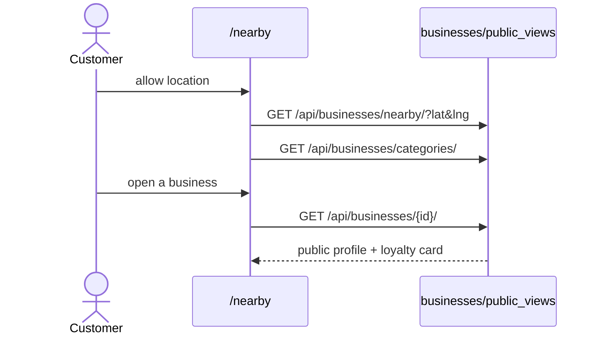

# Nearby Discovery

## Summary

How a customer finds businesses: a map + list of nearby businesses filtered by
location and category, drilling into a public business profile. Triggered by a
customer on `/nearby`. All endpoints public (no auth). Clean.

## Step-by-step

1. **Location.** `/nearby` (`_components/MiniMap.tsx`, `LocationPicker.tsx`)
   obtains lat/lng (geolocation or picker).
2. **List nearby.** `GET /api/businesses/nearby/?lat=…&lng=…`
   (`customer/api.ts:221`, `PublicBusinessListView`, `public_urls:11`).
3. **Filter by category.** `GET /api/businesses/categories/`
   (`customer/api.ts:225`, `public_urls:12`) populates filter chips.
4. **Open a business.** `/nearby/[id]` →
   `GET /api/businesses/<id>/` (`customer/api.ts:228`,
   `PublicBusinessDetailView`, `public_urls:14`) →
   `_components/BusinessDetailsContent.tsx` renders profile, loyalty card, hours.

## Mermaid

## Notes

No gaps. The business card here is the same target the [qr-resolution](qr-resolution.md)
flow lands on after a scan.
