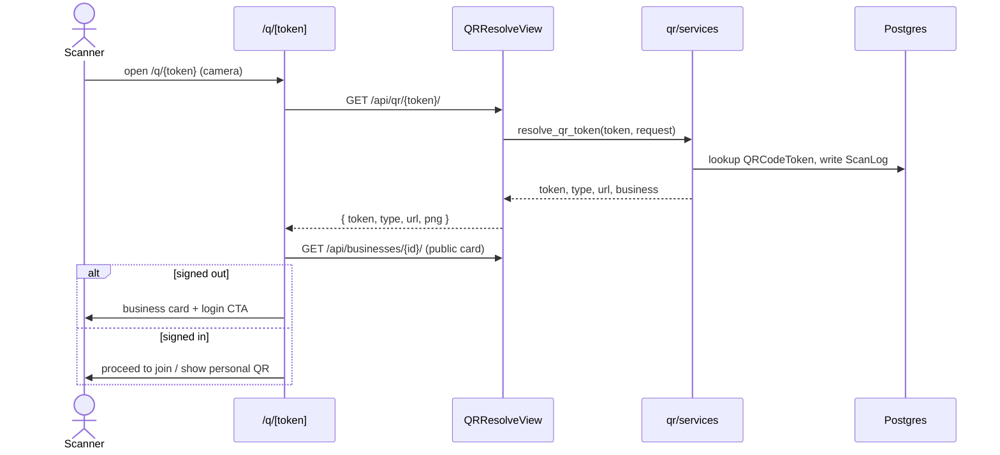

# QR Resolution

## Summary

What happens when someone scans a Jaqyn QR with a phone camera (not the staff
scanner). QR codes encode a frontend URL `/q/<token>`; opening it resolves the
token server-side and shows a business card with the loyalty/campaign context and
a login gate, so a first-time scanner is funneled into sign-up. Triggered by any
camera scan of a printed/displayed Jaqyn QR.

## Layers & services involved

- **Frontend:** `/q/[token]` (resolver page), `/scan` (in-app camera,
  `_components/QrScanner.tsx`), `/nearby/[id]` (business card target); API in
  `frontend/packages/api/src/customer/api.ts`.
- **Backend:** `apps/qr/views.py` (`QRResolveView`, `/api/qr/<token>/`) →
  `apps/qr/services.py` (`resolve_qr_token`, `render_png_data_url`).
- **Models:** `QRCodeToken` (type: staff / merchant / customer), `ScanLog`.
- **Config:** QR payloads are built from the `FRONTEND_URL` setting so the encoded
  link points at the Next app, not the API.

## Step-by-step

1. **Scan.** Phone camera opens the encoded URL `/q/<token>`
   (`app/q/[token]/page.tsx`). The in-app scanner `/scan` decodes to the same route.
2. **Resolve.** The page calls `GET /api/qr/<token>/` (`customer/api.ts:177`) →
   `QRResolveView.get` (`qr/views.py:53`) → `resolve_qr_token(token, request)`.
   **Out:** `{token, type, url, png}` (`qr/views.py:34`/serialized success body),
   identifying the owning business and QR type, and writing a `ScanLog`.
3. **Render the card.** The resolver shows the business card (name, loyalty type
   pill, campaign context) using `GET /api/businesses/<id>/`
   (`customer/api.ts:228`) for the public profile.
4. **Gate on auth.** A signed-out scanner sees a login CTA → routes into
   [customer-auth](customer-auth.md) with a `return` back to the business/card.
5. **Continue.** Signed-in customers proceed to the relevant action (join program/
   campaign, show personal QR) on `/nearby/[id]` or the loyalty/campaign detail.

## Mermaid

## Entry points & exit conditions

- **Entry:** any phone scan of a Jaqyn QR (printed table tent, business profile,
  customer-shared link), or the in-app `/scan`.
- **Success:** token resolved, business card shown, scanner routed to action or login.
- **Failure:** unknown/expired token → `resolve_qr_token` raises a not-found domain
  error → resolver shows an error boundary (`/q/[token]/error.tsx`).

## Gaps

- None broken for the customer-facing resolve. Note the staff-side counterpart
  (`POST /api/merchant/<id>/validate-code/`) is an 🟠 orphan — see
  [staff-scan-unified](staff-scan-unified.md#gaps).
- **Open question:** confirm `FRONTEND_URL` is set in every deploy env (a wrong
  value bakes a broken link into printed QRs — high blast radius, hard to recall).
