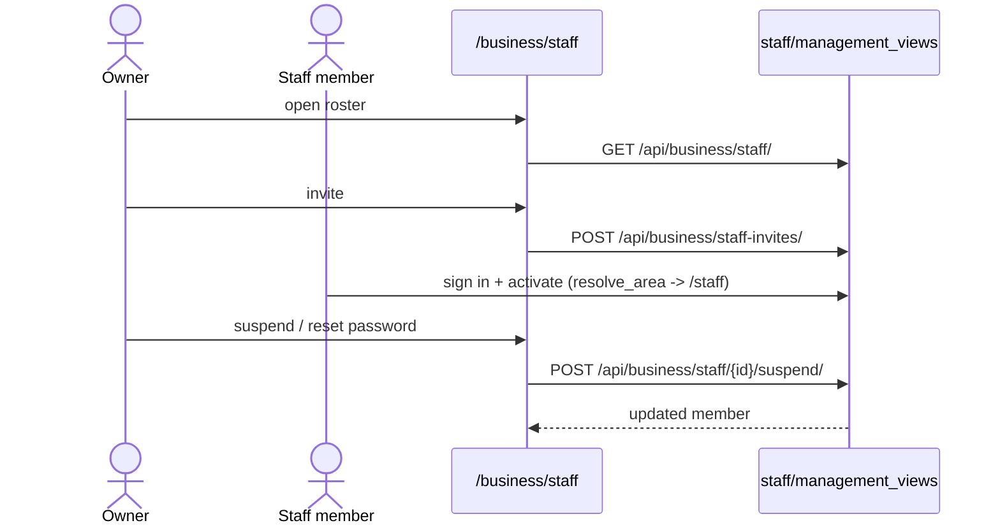

# Staff Invite & Management

## Summary

How an owner builds and manages a till team: invite staff, the invited person
activates, and the owner suspends / reactivates / resets passwords / removes
members. The roster view merges active members with pending invites. Triggered by a
business owner on `/business/staff`. Clean — all routes wired.

## Step-by-step

1. **Roster.** `/business/staff` → `GET /api/business/staff/`
   (`business/api.ts:186`/`:187`, `StaffTeamListView`, `management_urls:18`).
   The `TeamList` merges `StaffMember`s with open `StaffInvite`s.
2. **Invite.** `POST /api/business/staff-invites/` (`business/api.ts:183`,
   `businesses/urls.py:43`) creates a `StaffInvite`; revoke via
   `DELETE /api/business/staff-invites/<id>/` (`:184`).
3. **Activate.** The invited person signs in via [customer-auth](customer-auth.md)
   and is linked as staff (QR `link_staff_user`); `resolve_area` then routes them to
   `/staff`.
4. **Manage a member.** Detail `GET`/`PATCH /api/business/staff/<id>/`
   (`business/api.ts:188,190`); suspend `POST …/suspend/` (`:191`); reactivate
   `POST …/reactivate/` (`:192`); reset password `POST …/reset-password/` (`:194`);
   remove `DELETE /api/business/staff/<id>/` (`:195`).

## Mermaid

## Notes

No broken routes. Related orphan on the staff *operational* side:
`GET /api/staff/programs/` has no FE caller — see
[staff-scan-unified](staff-scan-unified.md#gaps).
