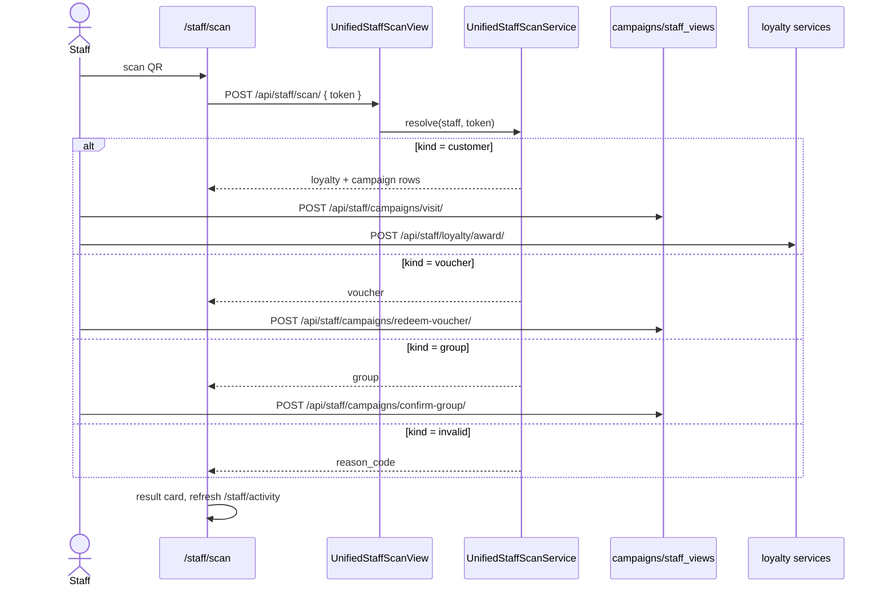

# Staff Unified Scan

## Summary

One scanner at the till handles everything. Staff points the camera at any Jaqyn
QR and the backend auto-routes by token type — a **customer** personal QR (advance
loyalty + campaigns), a **voucher** QR (redeem), or a **group** QR (confirm) — with
no mode toggle. Triggered by staff on `/staff/scan`.

## Layers & services involved

- **Frontend:** `/staff/scan` (+ `_components` scanner overlay), `/staff/activity`,
  `/staff/groups`; API in `frontend/packages/api/src/staff/api.ts`; hooks in
  `staff/hooks.ts`.
- **Backend:** `apps/loyalty/scan_views.py` (`UnifiedStaffScanView`, mounted at
  `/api/staff/scan/`, `config/urls.py:32`) → `apps/loyalty/scan.py`
  (`UnifiedStaffScanService.resolve`); campaign-specific confirm/redeem in
  `campaigns/views/staff_views.py`; `apps/qr/services.py` (`resolve_qr_token`).
- **Models:** `QRCodeToken`, `ApprovalCode`, `ScanLog`; `LoyaltyMembership`,
  `LoyaltyVoucher`; `CampaignParticipant`, `CampaignRewardVoucher`, `Group`.
- **Throttle:** `loyalty_scan` scope (`ScopedRateThrottle`).
- **Permission:** `IsStaff`; staff identity from `get_staff_for_user(request.user)`.

## Step-by-step

1. **Daily auth code.** Scanner pulls `GET /api/staff/today-code/`
   (`staff/api.ts:48`) for the till's current `ApprovalCode`.
2. **Scan a token.** The camera decodes a payload; FE posts
   `POST /api/staff/scan/` (`staff/api.ts:49`/`:64`) → `UnifiedStaffScanView.post`
   → `UnifiedStaffScanService.resolve(staff, token, request)`. The service
   `resolve_qr_token`s the raw value and branches on `kind`
   (`apps/loyalty/scan.py:48`):
   - `kind="customer"` → returns masked customer + eligible **loyalty** rows and
     **campaign** rows (each with `progress/required`, `mechanic="visit"`,
     `needs_amount` when the loyalty program is POINTS, `scan.py:101`).
   - `kind="voucher"` → returns the serialized loyalty **or** campaign voucher.
   - `kind="group"` → returns the `Group` for confirmation.
   - `kind="invalid"` → `reason_code` (`INVALID_QR_TOKEN`).
3. **Advance a customer.** On `customer`, staff confirms →
   `POST /api/staff/campaigns/visit/` (`staff/api.ts:97`, with optional `amount`)
   advances campaigns, and `POST /api/staff/loyalty/award/` (`staff/api.ts:76`,
   `loyalty/api.ts:22`) awards loyalty under a row lock (`LoyaltyEarningService.award`,
   `services/earning.py:36`, `select_for_update`).
4. **Redeem a voucher.** On `voucher`, scan +
   `POST /api/staff/campaigns/redeem-voucher/` (`staff/api.ts:137`) for campaign
   vouchers, or `POST /api/staff/loyalty/redeem-voucher/` (`staff/api.ts:136`,
   payload prefixed `loyalty:`) for loyalty ones → `LoyaltyRedemptionService`
   (`services/redemption.py`, `select_for_update`).
5. **Confirm a group.** On `group`, `POST /api/staff/campaigns/confirm-group/`
   (`staff/api.ts:139`) — see [campaign-group-session](campaign-group-session.md).
6. **Social proof (campaigns).** `POST /api/staff/campaigns/confirm-social/`
   (`staff/api.ts:147`) verifies a social-share campaign action.
7. **Result + activity.** The scanner shows a result card (auto-dismiss);
   `GET /api/staff/recent-activity/` (`staff/api.ts:54`) feeds `/staff/activity`.

## Mermaid

## Entry points & exit conditions

- **Entry:** `/staff/scan` (staff session; `/staff` and `/staff/login` redirect in).
- **Success:** correct branch fires; loyalty/campaign state advances or voucher
  redeems; `ScanLog` written.
- **Failure:** `kind="invalid"` → reason card; throttle (`loyalty_scan`) rejects
  scan floods; ineligible customer rows carry `reason_code`.

## Gaps

- 🔴 **Dead legacy redeem methods.** `staffApi.redeem` (`staff/api.ts:51` →
  `/api/staff/redeem/`) and `redeemManual` (`staff/api.ts:53` →
  `/api/staff/redeem/manual-code/`), plus hooks `useStaffRedeem`/
  `useStaffRedeemManual` (`staff/hooks.ts:19,27`), call routes that **don't exist** —
  `staff/urls.py` only declares `programs/`, `today-code/`, `scan/`,
  `recent-activity/`, and its comment (lines 6–8) says redeem moved to the unified
  scanner. No `.tsx` imports the hooks. **Fix:** delete `redeem`/`redeemManual`
  from `staff/api.ts:50–53` and the two hooks from `staff/hooks.ts`.
- 🟠 **Orphan `GET /api/staff/programs/`** (`StaffProgramsView`, `staff/urls.py:10`)
  — no FE caller (`staffApi` has no `programs` method). **Fix:** remove, or wire a
  staff "active programs" panel.
- 🟠 **Orphan `POST /api/merchant/<id>/validate-code/`** (`qr.merchant_urls`) —
  approval-code validation superseded by token scanning. Confirm dead and remove.
