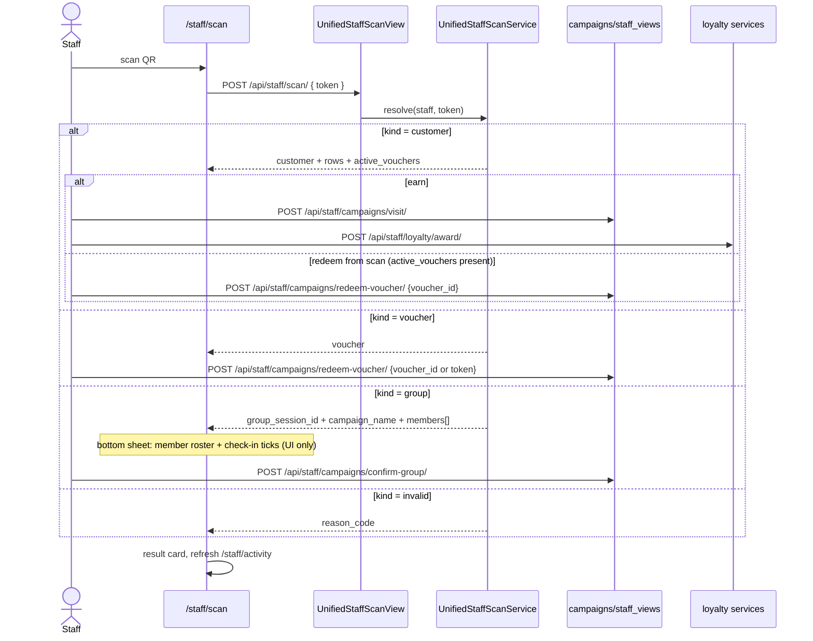

# Staff Unified Scan

## Summary

One scanner at the till handles everything. Staff points the camera at any Jaqyn
QR and the backend auto-routes by token type — a **customer** personal QR (advance
loyalty + campaigns, or redeem an active voucher inline), a **voucher** QR (redeem
directly), or a **group** QR (confirm with full roster) — with no mode toggle.
Triggered by staff on `/staff/scan`.

The customer-scan response includes `active_vouchers` (campaign + loyalty) so staff
can redeem straight from the same sheet without a second scan. Group-type campaigns
are excluded from the chooser rows on a customer scan — group completion is only
reachable via a group-type QR scan. Both redeem endpoints now accept `voucher_id`
as an alternative to `token`/`code`.

## Layers & services involved

- **Frontend:** `/staff/scan` (+ `_components` scanner overlay), `/staff/activity`,
  `/staff/profile`; API in `frontend/packages/api/src/staff/api.ts`; hooks in
  `staff/hooks.ts`. Bottom nav = **Scan · Activity · Profile** (Groups tab removed;
  `/staff/groups` redirects to `/staff/scan`).
- **Backend:** `apps/loyalty/scan_views.py` (`UnifiedStaffScanView`, mounted at
  `/api/staff/scan/`, `config/urls.py:32`) → `apps/loyalty/scan.py`
  (`UnifiedStaffScanService.resolve`); campaign-specific confirm/redeem in
  `campaigns/views/staff_views.py`; `apps/qr/services.py` (`resolve_qr_token`).
- **Models:** `QRCodeToken`, `ApprovalCode`, `ScanLog`; `LoyaltyMembership`,
  `LoyaltyVoucher`; `CampaignParticipant`, `CampaignRewardVoucher`, `Group`.
- **Throttle:** `loyalty_scan` scope (`ScopedRateThrottle`).
- **Permission:** `IsStaff`; staff identity from `get_staff_for_user(request.user)`.

## Step-by-step

1. **Daily auth code.** Scanner pulls `GET /api/staff/today-code/`
   (`staff/api.ts:48`) for the till's current `ApprovalCode`.
2. **Scan a token.** The camera decodes a payload; FE posts
   `POST /api/staff/scan/` (`staff/api.ts:49`/`:64`) → `UnifiedStaffScanView.post`
   → `UnifiedStaffScanService.resolve(staff, token, request)`. The service
   `resolve_qr_token`s the raw value and branches on `kind`
   (`apps/loyalty/scan.py:48`):
   - `kind="customer"` → returns masked customer name + eligible **loyalty** rows
     and **campaign** rows (each with `progress/required`, `mechanic="visit"`,
     `needs_amount` when the loyalty program is POINTS, `scan.py:101`), **plus
     `active_vouchers: [{id, source: "campaign"|"loyalty", label, expires_label}]`**
     for any redeemable vouchers the customer holds. Group-type campaign rows are
     excluded from this chooser — they only resolve via a group-kind scan.
   - `kind="voucher"` → returns the serialized loyalty **or** campaign voucher.
   - `kind="group"` → returns full group payload: `group_session_id`,
     `campaign_name`, `required_size`, `status`, `leader_name`,
     `members: [{name, status, is_leader}]`. See
     [campaign-group-session](campaign-group-session.md).
   - `kind="invalid"` → `reason_code` (`INVALID_QR_TOKEN`).
3. **Advance a customer.** On `customer`, staff chooses a program row →
   `POST /api/staff/campaigns/visit/` (`staff/api.ts:97`, with optional `amount`)
   advances campaigns, and `POST /api/staff/loyalty/award/` (`staff/api.ts:76`,
   `loyalty/api.ts:22`) awards loyalty under a row lock (`LoyaltyEarningService.award`,
   `services/earning.py:36`, `select_for_update`).
4. **Redeem from customer scan.** When `active_vouchers` is non-empty the UI pins
   a redeem entry at the top of the chooser sheet. Tapping it calls
   `POST /api/staff/campaigns/redeem-voucher/` (with `voucher_id`) for campaign
   vouchers, or `POST /api/staff/loyalty/redeem-voucher/` (with `voucher_id`,
   payload prefixed `loyalty:`) for loyalty ones — same endpoints as a direct
   voucher-QR scan. **No second scan required.**
5. **Redeem a voucher QR.** On `kind="voucher"` scan, same endpoints as step 4.
   Both accept `voucher_id` **or** `token`/`code`. → `LoyaltyRedemptionService`
   (`services/redemption.py`, `select_for_update`).
6. **Confirm a group.** On `kind="group"`, a bottom sheet shows the full member
   roster with per-member check-in ticks (UI-only; no per-member write). One
   primary action: `POST /api/staff/campaigns/confirm-group/` (`staff/api.ts:139`)
   — the single write that finalizes the session. See
   [campaign-group-session](campaign-group-session.md).
7. **Social proof (campaigns).** `POST /api/staff/campaigns/confirm-social/`
   (`staff/api.ts:147`) verifies a social-share campaign action.
8. **Stats.** `GET /api/staff/stats/` returns `{scans_today, redemptions_today}`
   (staff-scoped, timezone-aware today). Feeds stat tiles on the Activity and
   Profile screens.
9. **Result + activity.** The scanner shows a trimmed result card (auto-dismiss);
   `GET /api/staff/recent-activity/` (`staff/api.ts:54`) feeds `/staff/activity`.
   Response shape: `{count, next, previous, results: [{id, kind, customer,
   label, created_at}]}` where `kind` is one of `redeem | stamp | visit | points |
   social`. Supports `?kind=` filter and `page`/`page_size` (default 25, max 100).
   The old two-array `{scans, redemptions}` shape is gone.

## Mermaid

## Entry points & exit conditions

- **Entry:** `/staff/scan` (staff session; `/staff` and `/staff/login` redirect in).
- **Success:** correct branch fires; loyalty/campaign state advances or voucher
  redeems; `ScanLog` written.
- **Failure:** `kind="invalid"` → reason card; throttle (`loyalty_scan`) rejects
  scan floods; ineligible customer rows carry `reason_code`.

## Gaps

- 🔴 **Dead legacy redeem methods.** `staffApi.redeem` (`staff/api.ts:51` →
  `/api/staff/redeem/`) and `redeemManual` (`staff/api.ts:53` →
  `/api/staff/redeem/manual-code/`), plus hooks `useStaffRedeem`/
  `useStaffRedeemManual` (`staff/hooks.ts:19,27`), call routes that **don't exist** —
  `staff/urls.py` only declares `programs/`, `today-code/`, `scan/`,
  `recent-activity/`, and its comment (lines 6–8) says redeem moved to the unified
  scanner. No `.tsx` imports the hooks. **Fix:** delete `redeem`/`redeemManual`
  from `staff/api.ts:50–53` and the two hooks from `staff/hooks.ts`.
- 🟠 **Orphan `GET /api/staff/programs/`** (`StaffProgramsView`, `staff/urls.py:10`)
  — no FE caller (`staffApi` has no `programs` method). **Fix:** remove, or wire a
  staff "active programs" panel.
- 🟠 **Orphan `POST /api/merchant/<id>/validate-code/`** (`qr.merchant_urls`) —
  approval-code validation superseded by token scanning. Confirm dead and remove.

*Resolved in feat/staff-app-handoff:*
- ~~Group scan returned no payload~~ → `kind="group"` now returns full roster
  (`group_session_id`, `campaign_name`, `required_size`, `status`, `leader_name`,
  `members[{name, status, is_leader}]`).
- ~~`recent-activity` two-array shape~~ → replaced with paginated unified events
  list (`count/next/previous/results`), `?kind=` filter, default page_size 25.
